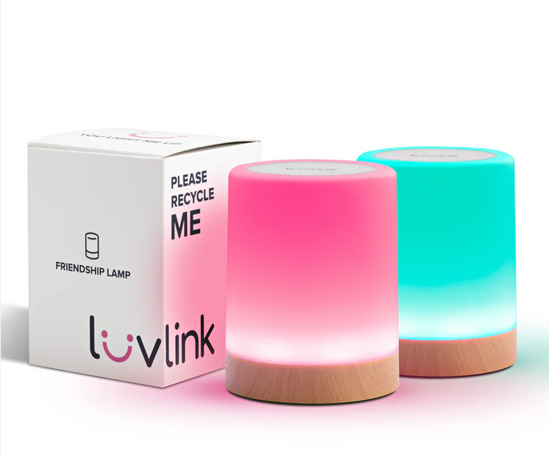
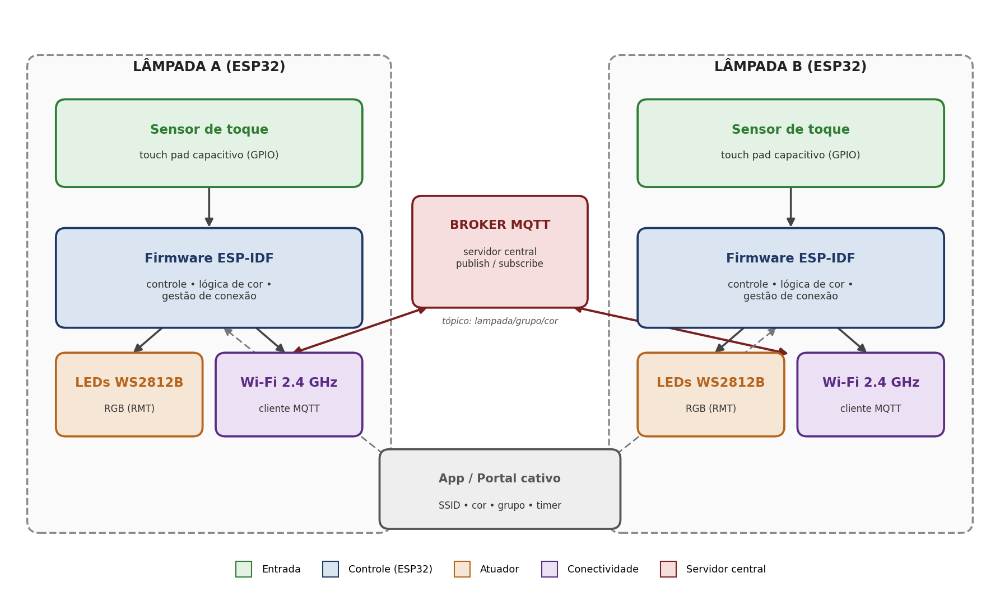

# Trabalho 2 (2026-1)

> Fundamentos de Sistemas Embarcados — UnB/FGA  

## 1. Objetivos

Este trabalho apresenta um estudo teórico-exploratório sobre um produto embarcado existente — a **lâmpada de amizade sincronizada** (*Long-Distance Friendship Lamp*) — descrevendo suas funções, arquitetura e tecnologias, e propondo um modelo conceitual de reprodução das suas principais funcionalidades com uma **ESP32** e componentes simples do ecossistema **ESP-IDF**. O estudo levanta ainda a bibliografia acadêmica relacionada às tecnologias que viabilizam o produto e às suas aplicações, e compara o produto com similares de mercado.

### Integrantes

| Nome | Matrícula |
|------|-----------|
| *Felipe Matheus Ribeiro Lopes* | *221031274* |
| *Rafael Souto Lopes Laube* | *211062428* |
| *Pedro Fonseca Cruz* | *212005444* |
| *Paulo Henrique Melo de Souza* | *221022417* |

---

## 2. Descrição técnica do produto original

### 2.1 Funções principais, público-alvo e contexto de uso

A **lâmpada de amizade** (comercializada como *Friendship Lamp*, *Long-Distance Lamp* ou *Long-Distance Touch Lamp*) é um par — ou conjunto — de luminárias conectadas à internet que se mantêm **sincronizadas em cor**. Ao tocar uma unidade, todas as outras do mesmo grupo acendem instantaneamente na mesma cor, em qualquer lugar do mundo, bastando uma conexão Wi-Fi. O produto funciona como um canal de **comunicação ambiente e simbólica**: em vez de uma mensagem de texto, envia-se *presença* e afeto por meio da luz.

O produto de referência deste estudo é a **Friendship Lamp da Filimin**, empresa que se apresenta como inventora original da tecnologia (com duas patentes registradas), tomada como representante da categoria.

- **Função principal:** sincronizar a cor da luz entre unidades remotas, em tempo real, ao toque do usuário.
- **Funções secundárias:** escolha entre centenas de cores (a Filimin Classic oferece mais de 250 cores programáveis), ajuste de brilho, *timer* de desligamento (ex.: 30 min, 1,5 h, 8 h e 24 h), apelidos por unidade e grupos com múltiplas lâmpadas.
- **Público-alvo:** casais em relacionamento à distância, famílias separadas geograficamente, avós e netos, amigos e famílias de militares.
- **Contexto de uso:** doméstico, como objeto decorativo de mesa/cabeceira que se integra ao ambiente sem ser intrusivo (ao contrário das notificações de um celular).

  
  
<b>Figura 1:</b> Lâmpada de amizade (inserir foto real em <code>assets/</code>). Fonte: friendshiplamps.com

### 2.2 Principais módulos do sistema

| Módulo | Papel no sistema | Implementação típica |
|--------|------------------|----------------------|
| Entrada (sensor) | Captura a intenção do usuário (toque) | Painel de toque capacitivo (em alguns modelos, botão) |
| Controle | Executa o firmware, lê o toque, gerencia a conexão e comanda o atuador | Microcontrolador com Wi-Fi (classe ESP8266/ESP32) |
| Conectividade | Liga o dispositivo à internet e ao servidor | Wi-Fi 2,4 GHz (IEEE 802.11 b/g/n) + cliente MQTT/HTTP |
| Servidor central | Desacopla as unidades: recebe o evento de uma lâmpada e o redistribui às demais | *Broker* MQTT / *backend* em nuvem |
| Atuador | Converte o estado (cor) recebido em luz | LEDs RGB endereçáveis (WS2812B/NeoPixel) + difusor acrílico |
| Interface | Configuração e personalização | Aplicativo móvel + portal cativo (SSID próprio na 1ª configuração) |

### 2.3 Sensores e atuadores do produto

- **Sensor de toque capacitivo:** detecta o toque do usuário na superfície da luminária, disparando a mudança/envio de cor. Não exige partes móveis.
- **Atuador de iluminação:** LEDs RGB endereçáveis (tipo WS2812B), com controlador integrado por LED, permitindo centenas de cores e efeitos a partir de uma única linha de dados.
- **Alimentação:** via USB/adaptador 5 V.

### 2.4 Protocolos e tecnologias de comunicação

O coração da categoria é a comunicação **cliente → servidor central → clientes**. As unidades não conversam diretamente entre si: cada uma se conecta a um servidor que intermedeia as mensagens. O padrão predominante é o **MQTT** (modelo *publish/subscribe*), embora existam implementações via **HTTP/REST com *polling*** periódico. O acesso à internet se dá por **Wi-Fi 2,4 GHz**, e a configuração inicial de rede é feita por **portal cativo** (a unidade emite um SSID próprio para o usuário informar as credenciais do Wi-Fi doméstico).

---

## 3. Descrição do sistema proposto (baseado em ESP32)

### 3.1 Funções principais, público-alvo e contexto de uso

O sistema proposto reproduz a função central do produto — *"tocar aqui acende lá"* — usando uma **ESP32** por unidade. Mantém o mesmo público-alvo e contexto de uso doméstico, com custo de componentes muito inferior ao produto comercial.

### 3.2 Componentes e sensores utilizados

| Componente | Função | Observação |
|-----------|--------|-----------|
| ESP32 (DevKit) | Controle, Wi-Fi e lógica de cor | SoC com Wi-Fi/BLE integrados |
| Sensor de toque | Entrada do usuário | Touch pad capacitivo nativo do ESP32 ou módulo TTP223 |
| Anel/fita WS2812B (NeoPixel) | Atuador RGB | Controlado pelo periférico RMT |
| Difusor acrílico | Espalhar a luz | Estética/ambientação |
| Fonte 5 V | Alimentação | USB ou adaptador |

### 3.3 Tecnologias de comunicação e controle embarcadas

#### 3.3.1 Conectividade Wi-Fi (ESP32)

O ESP32 possui rádio **Wi-Fi 802.11 b/g/n (2,4 GHz)** integrado, dispensando módulo externo. A banda de 2,4 GHz favorece alcance e penetração em paredes — adequada a um objeto doméstico fixo. A pilha de rede é gerenciada pelo **ESP-NETIF** e pelo *event loop* do ESP-IDF, com reconexão automática.

#### 3.3.2 Protocolo MQTT (*Message Queue Telemetry Transport*)

Protocolo leve de aplicação, do tipo *publish/subscribe*, ideal para dispositivos de baixa potência e banda limitada. Cada lâmpada **publica** a cor escolhida em um tópico (ex.: `lampada/grupo/cor`) e **assina** o mesmo tópico para refletir a cor das demais. O *broker* central desacopla emissor e receptor. Recursos úteis: **QoS** (garante entrega da mudança de cor), **mensagem retida** (nova unidade já entra na cor atual) e ***Last Will and Testament*** (detecta unidade offline).

---

## 4. Proposta de reprodução com ESP32

### 4.1 Estrutura do projeto

Fluxo de operação proposto:

1. O usuário **toca** a Lâmpada A.
2. O firmware detecta o toque, avança/define a cor local e **publica** o evento no tópico do *broker* MQTT.
3. O *broker* entrega o evento a todas as lâmpadas **inscritas** no tópico.
4. A Lâmpada B recebe a mensagem e atualiza seus LEDs WS2812B para a mesma cor.
5. Em repouso, a ESP32 pode entrar em *light sleep*, despertando por toque ou por mensagem recebida.

### 4.2 Configurações dos componentes compatíveis com o ecossistema ESP-IDF

#### 4.2.1 Entrada — sensor de toque
Uso do periférico **Touch Sensor** nativo do ESP32 (GPIOs capacitivos) ou de um módulo **TTP223**. Debounce por software; o toque avança a paleta de cores ou confirma o envio.

#### 4.2.2 Atuador — LEDs WS2812B
Controle via periférico **RMT** do ESP32 (gera o *timing* de sub-microsegundo do protocolo WS2812B sem travar a CPU), usando o componente `led_strip` do ESP-IDF. Recomenda-se **resistor de série (~330–470 Ω)** na linha de dados e **capacitor de ~1000 µF** na alimentação. Como o WS2812B opera em 5 V e o ESP32 em 3,3 V, pode ser necessário um **level shifter** na linha de dados.

#### 4.2.3 Conectividade e provisionamento
Wi-Fi nativo (`esp_wifi`) com reconexão automática. Provisionamento por **portal cativo** (modo SoftAP na primeira inicialização): a lâmpada cria um SSID próprio, o usuário informa a rede doméstica e o grupo/tópico.

#### 4.2.4 Comunicação — cliente MQTT
Componente **`esp-mqtt`** do ESP-IDF conectado a um *broker* (Mosquitto próprio ou Adafruit IO). Publicação/assinatura no tópico do grupo; idealmente **MQTT sobre TLS** para proteger os dados.

### 4.3 Configuração GPIO

Possível configuração de pinos para o protótipo (uma unidade):

| Periférico | Pino GPIO | Tipo | Observação |
|-----------|-----------|------|-----------|
| Touch pad | GPIO 4 (T0) | Touch capacitivo | Entrada do toque |
| Dados WS2812B | GPIO 18 | RMT | Linha de dados (DIN) |
| LED status | GPIO 2 | GPIO/PWM | Indicador de conexão |
| Botão reset Wi-Fi | GPIO 0 | GPIO (pull-up) | Reentrar no portal cativo |
| Alimentação LED | 5 V / GND | — | Externa se muitos LEDs |

### 4.4 Diagrama conceitual do sistema (diagrama de blocos)

O diagrama a seguir separa entradas, controle (ESP32), atuador, conectividade e o servidor central, mostrando a comunicação *publish/subscribe* entre duas lâmpadas por meio do *broker* MQTT.

  
  
<b>Figura 2:</b> Diagrama de blocos do sistema proposto com ESP32.

### 4.5 Limitações e desafios esperados

- **Dependência de servidor:** sem *broker* no ar, as lâmpadas param de sincronizar. Um *broker* próprio (Mosquitto) evita depender de terceiros, mas exige hospedagem.
- **Provisionamento amigável:** fazer o portal cativo funcionar para um usuário leigo (sem reprogramar a placa) é o maior desafio de usabilidade.
- **Confiabilidade da rede:** reconexão automática de Wi-Fi/MQTT, *Last Will and Testament* para status offline e cor retida para reentrada.
- **Compatibilidade elétrica:** ajuste de nível lógico 3,3 V → 5 V do WS2812B e dimensionamento da fonte conforme o número de LEDs (~60 mA por LED em brilho máximo).
- **Segurança:** habilitar TLS no MQTT e proteger as credenciais de Wi-Fi.
- **Energia:** conciliar resposta instantânea ao toque com baixo consumo — o rádio Wi-Fi é o maior gasto.

---

## 5. Pesquisa bibliográfica e tecnológica

### 5.1 Tecnologia

#### **5.1.1 MQTT-S — A Publish/Subscribe Protocol for Wireless Sensor Networks**
**Autores:** U. Hunkeler; H. L. Truong; A. Stanford-Clark.
**Publicado em:** 2008, IEEE COMSWARE (International Conference on Communication Systems Software and Middleware).
**Link:** [PDF](https://sites.cs.ucsb.edu/~rich/class/cs293b-cloud/papers/mqtt-s.pdf)
**Resumo:** Apresenta uma extensão do protocolo publish/subscribe leve voltada a dispositivos de baixo custo e baixa potência em redes com restrição de banda, detalhando o papel do *broker* central, o modelo de tópicos e o desacoplamento entre emissor e receptor.
**Aplicação em sistemas embarcados:** É o fundamento do mecanismo que sincroniza as lâmpadas (tocar → publicar → *broker* → assinantes acendem). Justifica tecnicamente a escolha do MQTT no sistema proposto com ESP32.

#### **5.1.2 Lightweight Embedded IoT Gateway for Smart Homes Based on an ESP32 Microcontroller**
**Autores:** Filippas Serepas, Ioannis Papias, Konstantinos Christakis, Nikos Dimitropoulos
**Publicado em:** 2025, *Computers* (MDPI), v. 14, n. 9, artigo 391.
**Link:** [PDF (acesso aberto)](https://www.mdpi.com/2073-431X/14/9/391)
**Resumo:** Projeta e implementa um *gateway* IoT doméstico sobre ESP32 usando MQTT e REST, justificando tecnicamente o SoC (Wi-Fi/BLE integrados, consumo abaixo de 1 W, baixo custo) frente a alternativas como *single-board computers*.
**Aplicação em sistemas embarcados:** Embasa o núcleo embarcado da reprodução proposta (ESP32 + MQTT), mostrando padrões de arquitetura, controle local e economia de energia aplicáveis à lâmpada.

#### **5.1.3 TinyML: Analysis of Xtensa LX6 Microprocessor for Neural Network Applications by ESP32 SoC**
**Autores:** Md Ziaul Haque Zim
**Publicado em:** 2021, arXiv:2106.10652.
**Link:** [PDF (acesso aberto)](https://arxiv.org/pdf/2106.10652)
**Resumo:** Analisa a arquitetura e a capacidade do processador **Xtensa LX6** que equipa o ESP32, avaliando desempenho e limites de execução local.
**Aplicação em sistemas embarcados:** Fornece a base para a seção de *arquitetura de processador*, permitindo dimensionar o que o MCU consegue executar localmente (lógica de cor, gestão de conexão, provisionamento).

#### **5.1.4 Experimental Characterization of RGB LED Transceiver in Low-Complexity LED-to-LED Link**
**Autores:** Mariam Galal, Wai Pang Ng, Richard James Binns, Ahmed Abd El Aziz
**Publicado em:** 2020, *Sensors* (MDPI), via PMC.
**Link:** [PDF (acesso aberto)](https://www.ncbi.nlm.nih.gov/pmc/articles/PMC7600371/)
**Resumo:** Caracteriza experimentalmente LEDs RGB de baixo custo como elementos optoeletrônicos, medindo comportamento espectral e de resposta.
**Aplicação em sistemas embarcados:** Embasa o **atuador** do produto (LED RGB) e suas restrições de potência/cor. *Observação:* trata o LED também como transmissor óptico (comunicação), enquanto no produto o LED é apenas atuador de cor — é o artigo mais tangencial do conjunto (ver ranking ao final).

### 5.2 Aplicação / uso

#### **5.2.1 Connecting Couples in Long-Distance Relationships: Towards Unconventional Computer-Mediated Emotional Communication Systems**
**Autores:** H. Li (orient. J. Häkkilä; K. Väänänen).
**Publicado em:** 2020, Tese de doutorado, University of Lapland (Rovaniemi, Finlândia).
**Link:** [Repositório](https://lauda.ulapland.fi/handle/10024/64473)
**Resumo:** Investiga, por meio de oito estudos de caso em IHC, interfaces não convencionais (incluindo *displays* ambientes e vestíveis) para mediar a comunicação emocional entre casais à distância, propondo um *framework* de projeto para esses sistemas.
**Aplicação em sistemas embarcados:** Dá o enquadramento teórico do "porquê" do produto — presença e afeto à distância — e situa a lâmpada dentro da família de dispositivos de comunicação ambiente.

#### **5.2.2 Connected Candles: Aesthetic Nostalgia Mediated Design for Long Distance Relationship**
**Autores:** 
Jonna Häkkilä, Hong Li, Saara Koskinen, Ashley Colley
**Publicado em:** 2021.
**Link:** [ResearchGate](https://www.researchgate.net/publication/358765553)
**Resumo:** Apresenta um par de "velas" conectadas pela internet — acender a vela real em um local ilumina a eletrônica no outro — avaliadas como *display* periférico para mediar afeto entre casais à distância.
**Aplicação em sistemas embarcados:** É um **análogo quase direto** da lâmpada de amizade (par de objetos de luz conectados por rede), sendo a melhor evidência de uso do conceito.

#### **5.2.3 Light Bridge: Improving Social Connectedness Through Ambient Spatial Interaction**
**Autores:** Jan Hommes, Michael Kipp
**Publicado em:** 2024, ACM (Digital Library).
**Link:** [ACM](https://dl.acm.org/doi/fullHtml/10.1145/3643834.3660689)
**Resumo:** Propõe uma interação ambiente que transmite co-presença por mudanças na iluminação; um estudo com 20 participantes indica que a luz comunica proximidade sem ser intrusiva nem violar a privacidade.
**Aplicação em sistemas embarcados:** Evidência empírica do efeito buscado pelo produto (conexão social por luz ambiente), útil para a discussão de usabilidade e valor da reprodução.

#### **5.2.4 Evaluating Human Activity-Based Ambient Lighting Displays for Effective Peripheral Communication**
**Autores:** Kadian Davis-Owusu, Evans Owusu, Lucio Marcenaro, Loe Feijs
**Publicado em:** 2018.
**Link:** [ResearchGate](https://www.researchgate.net/publication/316754972)
**Resumo:** Desenvolve e avalia uma plataforma de *display* de iluminação ambiente bidirecional (incluindo lâmpada Philips Hue) para *awareness* e conexão social em tempo real, com ganhos medidos em presença social.
**Aplicação em sistemas embarcados:** Mostra, com métricas, que iluminação ambiente conectada aumenta a sensação de presença — sustentando a proposta de valor da lâmpada.

---

## 6. Comparativo com produtos similares

A tabela reúne produtos da mesma categoria (lâmpadas/objetos de presença à distância), de fabricantes e gerações diferentes. O produto estudado está destacado. Além dos produtos comerciais, inclui-se a versão *DIY* de código aberto como referência de custo/arquitetura.

| Produto | Fabricante / Origem | Conectividade | Entrada | Atuador / Cores | App · Assinatura | Geração | Preço aprox.* |
|---------|--------------------|---------------|---------|-----------------|------------------|---------|---------------|
| **Friendship Lamp Classic (estudado)** | **Filimin (EUA)** | **Wi-Fi 2,4 GHz** | **Toque capacitivo** | **LED RGB · 250+ cores** | **App · sem assinatura** | **Original (2 patentes)** | **≈ US$ 100/un.** |
| FriendLi | Filimin (EUA) | Wi-Fi 2,4 GHz | Toque | LED RGB | App · **assinatura obrigatória** | Recente | ≈ US$ 80/par |
| Long Distance Friendship Lamp | Uncommon Goods (revende Filimin) | Wi-Fi 2,4 GHz | Toque | LED RGB · 100+ cores | App · sem assinatura | Comercial | ≈ US$ 120/par |
| LuvLink v2.0 | LuvLink | Wi-Fi | Toque | LED RGB | App · sem assinatura | Atual | ≈ US$ 60/par |
| ZOCI VOCI Telepathy | ZOCI VOCI | Wi-Fi | Toque | LED RGB | App · sem assinatura | Atual | ≈ US$ 55/par |
| Tikkitouch | Tikkitouch | Wi-Fi + Bluetooth (setup) | Toque | LED RGB | App · sem assinatura | Atual | ≈ US$ 50/par |
| Lâmpada DIY (referência) | Open-source (ESP8266/ESP32) | Wi-Fi + MQTT | Botão/toque | WS2812B (NeoPixel) | Sem app · sem assinatura | Maker | ≈ US$ 5–15/un. |

**Leitura do comparativo:** a categoria é tecnicamente homogênea (Wi-Fi 2,4 GHz + toque + LED RGB + nuvem). Os fatores de diferenciação são a **assinatura** (a maioria dispensa; a FriendLi exige), a **independência de servidor** (a versão *DIY* pode rodar um *broker* próprio), o **custo** (a versão aberta é uma ordem de grandeza mais barata) e o **acabamento/UX** (provisionamento e materiais dos produtos comerciais). Isso mostra que a reprodução com ESP32 é viável e de baixo custo, ficando o principal valor agregado dos produtos comerciais na experiência de uso e no suporte.

### Ranking dos artigos (do mais útil ao menos provável de uso)

| # | Artigo | Tipo | Justificativa |
|---|--------|------|---------------|
| 1 | Lightweight Embedded IoT Gateway (ESP32) | Tecnologia | Cobre MCU + protocolo + arquitetura num só artigo; o que mais encaixa na reprodução. |
| 2 | MQTT-S (Publish/Subscribe) | Tecnologia | Explica diretamente o mecanismo de sincronização das lâmpadas. |
| 3 | Connected Candles | Aplicação | Análogo quase 1:1 do produto; melhor evidência de uso. |
| 4 | Connecting Couples in LDR (Li, 2020) | Aplicação | Enquadramento teórico forte, um pouco mais amplo. |
| 5 | TinyML — Xtensa LX6 (ESP32) | Tecnologia | Ótimo para arquitetura do processador; foco em redes neurais excede o necessário. |
| 6 | Light Bridge | Aplicação | Boa evidência empírica, mas o gatilho é localização/atividade, não o toque. |
| 7 | Ambient Lighting Displays (peripheral) | Aplicação | Relevante, mas o contexto é *ambient assisted living* (idosos). |
| 8 | RGB LED Transceiver | Tecnologia | Mais tangencial: trata o LED como transmissor óptico, não como atuador de cor. |

---

## 7. Referências

> FILIMIN. Friendship Lamps. Disponível em: https://friendshiplamps.com/. Acesso em: 30 jun. 2026.

> HUNKELER, U.; TRUONG, H. L.; STANFORD-CLARK, A. MQTT-S — A publish/subscribe protocol for Wireless Sensor Networks. In: International Conference on Communication Systems Software and Middleware (COMSWARE). Bangalore: IEEE, 2008. p. 791–798. Disponível em: https://sites.cs.ucsb.edu/~rich/class/cs293b-cloud/papers/mqtt-s.pdf. Acesso em: 30 jun. 2026.

> KRAUSS, J. remote-friendship-lamp. GitHub, 2020. Disponível em: https://github.com/juekr/remote-friendship-lamp. Acesso em: 30 jun. 2026.

> LI, H. Connecting couples in long-distance relationships: towards unconventional computer-mediated emotional communication systems. Tese (Doutorado) — University of Lapland, Rovaniemi, 2020. Disponível em: https://lauda.ulapland.fi/handle/10024/64473. Acesso em: 30 jun. 2026.

> LIGHT BRIDGE: improving social connectedness through ambient spatial interaction. ACM, 2024. Disponível em: https://dl.acm.org/doi/fullHtml/10.1145/3643834.3660689. Acesso em: 30 jun. 2026. ⚠ Confirmar autoria/veículo.

> LIGHTWEIGHT embedded IoT gateway for smart homes based on an ESP32 microcontroller. Computers (MDPI), v. 14, n. 9, art. 391, 2025. Disponível em: https://www.mdpi.com/2073-431X/14/9/391. Acesso em: 30 jun. 2026. ⚠ Confirmar autoria.

> CONNECTED candles: aesthetic nostalgia mediated design for long distance relationship. 2021. Disponível em: https://www.researchgate.net/publication/358765553. Acesso em: 30 jun. 2026. ⚠ Confirmar autoria/veículo.

> EVALUATING human activity-based ambient lighting displays for effective peripheral communication. 2018. Disponível em: https://www.researchgate.net/publication/316754972. Acesso em: 30 jun. 2026. ⚠ Confirmar autoria/veículo.

> EXPERIMENTAL characterization of RGB LED transceiver in low-complexity LED-to-LED link. Sensors (MDPI), 2020. Disponível em: https://www.ncbi.nlm.nih.gov/pmc/articles/PMC7600371/. Acesso em: 30 jun. 2026. ⚠ Confirmar autoria.

> TINYML: analysis of Xtensa LX6 microprocessor for neural network applications by ESP32 SoC. arXiv:2106.10652, 2021. Disponível em: https://arxiv.org/pdf/2106.10652. Acesso em: 30 jun. 2026. ⚠ Confirmar autoria.

> UNCOMMON GOODS. Long Distance Friendship Lamp. Disponível em: https://www.uncommongoods.com/product/long-distance-friendship-lamp. Acesso em: 30 jun. 2026.

> WEBDEVBRIAN. LongDistanceArduinoLamp. GitHub. Disponível em: https://github.com/webdevbrian/LongDistanceArduinoLamp. Acesso em: 30 jun. 2026.
